<h1 align="center"><a href="">Hitaya oneAPI</a></h1>
  
<strong>Hitaya oneAPI </strong>Medical diagnosis using machine learning - Machine Learning has been revolutionizing on healthcare domain. ML models can now detect patterns underlying diseases. In this way, AI techniques can be considered as the second pair of eyes that can decode patient health knowledge extracted from large data sets by summing up facts & observations of diseases. Due to the COVID-19 pandemic existing digital diagnosis methods are being preferred as people are willing to follow COVID norms & stay safe .


## Features
- Creating an AI/ML preliminary diagnosis application.
- Users/Doctors can input images of x-ray scans/ medical data/ or just images and our Application will give them the diagnosis results.


## 1. Project Architecture

<p align="center">
  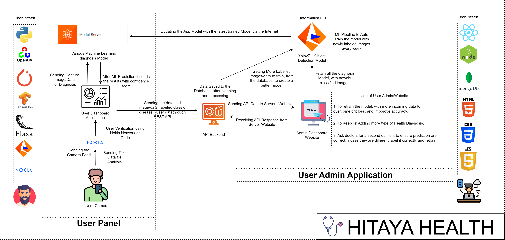
</p>

### Process Flow Diagram

<hr>

<p align="center">
  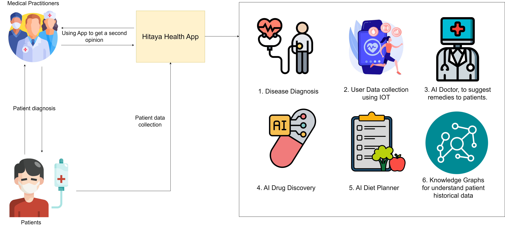
</p>


## 2. Getting Started With The Application

```sh
$ git clone https://github.com/IntelegixLabs/Hitaya_oneAPI.git
$ cd Hitaya_oneAPI
$ pip install -r requirements.txt
$ pip3 install torch torchvision torchaudio
$ python app.py
```

### 2.1 Open Gateway (Hackathon) Additions

- This fork adds network-aware capabilities aligned with the Open Gateway Hackathon theme: Healthcare Access & Emergency Services (Telemedicine + patient verification).
- New blueprint: `network` with endpoints under `\hitaya\api\v1\network`.
- Uses RapidAPI Nokia Network-as-Code CAMARA Number Verification.

Set your secret in environment before running the app:

```sh
# Windows PowerShell
$env:RAPIDAPI_KEY = "<your_rapidapi_key>"
```

Endpoints:

- POST `\hitaya\api\v1\network\verify`
  - Body: `{ "phoneNumber": "+91XXXXXXXXXX" }`
  - Optional header: `x-rapidapi-key: <your_rapidapi_key>` (overrides env)
- GET `\hitaya\api\v1\network\device-status` (scaffold)
- GET `\hitaya\api\v1\network\location` (scaffold)
- POST `\hitaya\api\v1\network\qod` (scaffold)

Example (local):

```bash
curl --location "http://127.0.0.1:5000/hitaya/api/v1/network/verify" \
  --header "Content-Type: application/json" \
  --data '{"phoneNumber":"+919547966499"}'
```

Note: For production, always set `RAPIDAPI_KEY` as an environment variable; do not hardcode secrets.
  
### 3. Application Screenshots

<br />
<p align="center">
  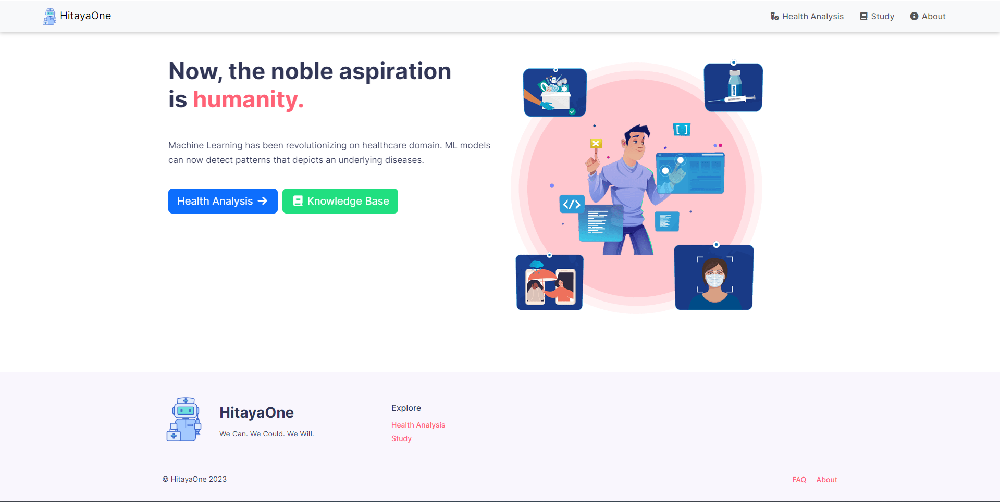
  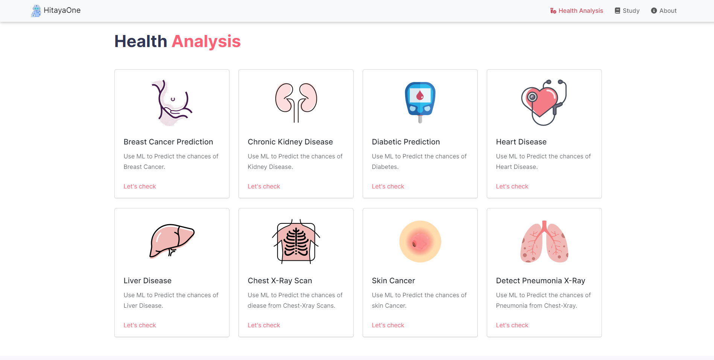
  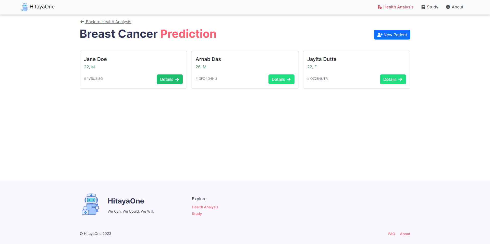
  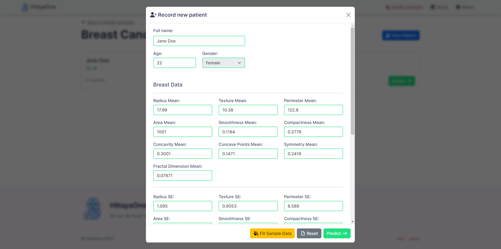
  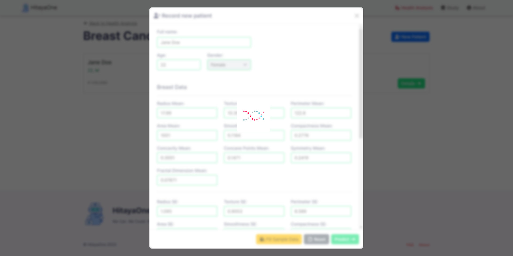
  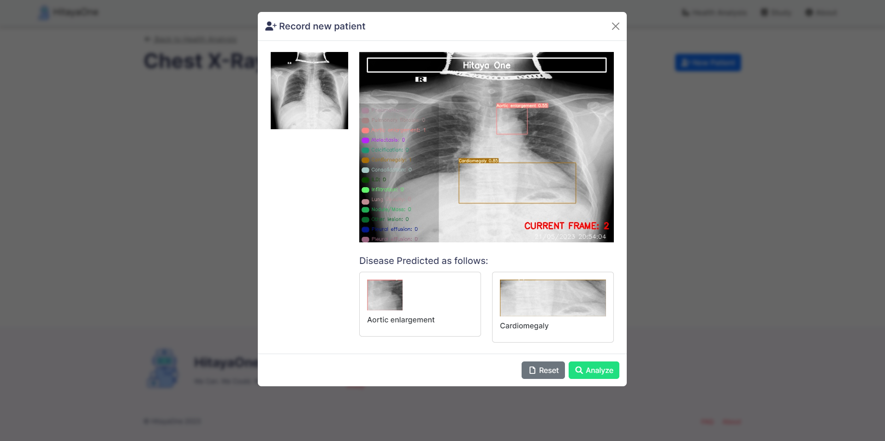
  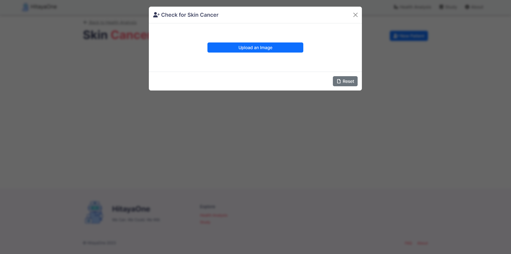
  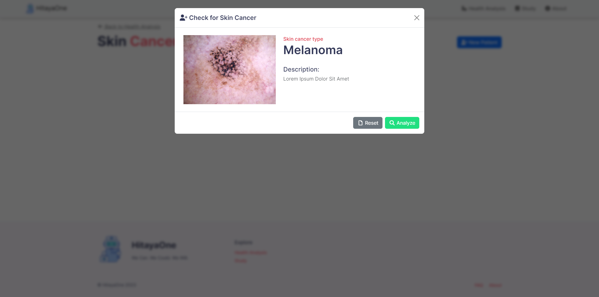
  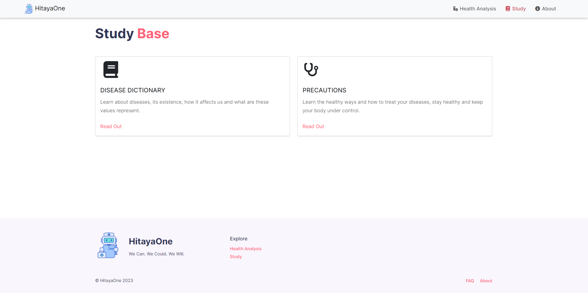
  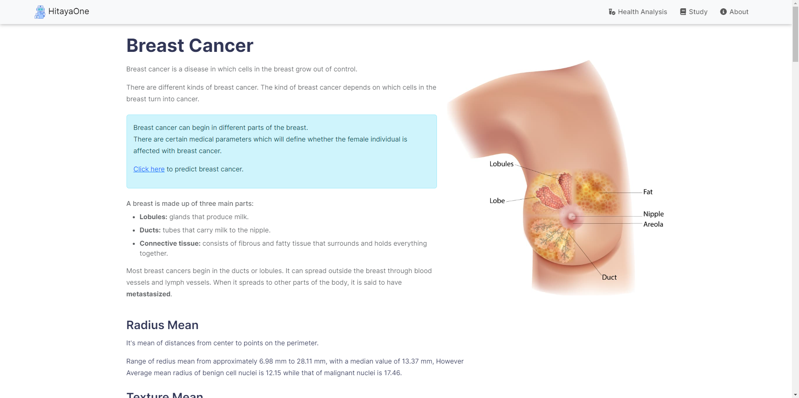
</p>
<br />

### 4. Medium Posts
1. [HitayaOne Overview](https://medium.com/@manijb13/hitaya-oneapi-healthcare-for-underserved-communities-5b4a563f08f7)
2. [Diabetes Prediction](https://medium.com/@manijb13/hitaya-oneapi-machine-learning-model-training-using-intel-oneapi-53b06e92b21c)
3. [Breast Cancer](https://medium.com/@raj713335/hitaya-oneapi-breast-cancer-machine-learning-model-training-using-intel-oneapi-797bf1521301)
4. [Heart Disease](https://medium.com/@raj713335/hitaya-oneapi-heart-disease-machine-learning-model-training-using-intel-oneapi-extension-for-c00b163042df)
5. [Liver Disease](https://medium.com/@raj713335/hitaya-oneapi-liver-disease-machine-learning-model-prediction-using-intel-oneapi-78129d193bb9)
6. [Chronic Kidney Disease](https://medium.com/@raj713335/hitaya-oneapi-chronic-kidney-disease-machine-learning-model-training-using-intel-oneapi-dbf6f85f1544)
7. [Skin Cancer Prediction](https://itsjb13.medium.com/hitaya-oneapi-skin-cancer-detection-using-intel-optimization-for-tensorflow-eb95d54564af)

## 5. Open Gateway Architecture (Mermaid)

```mermaid
flowchart LR
  User[Patient / Clinician] -- HTTPS --> WebAPI[Hitaya Flask API]\n(/hitaya/api/v1)
  subgraph Hitaya Services
    WebAPI -- ML Inference --> Diseases[Disease Modules]\n(chest_xray, skin_cancer, heart, etc)
    WebAPI -- Verify Number --> NetworkBLP[Network Blueprint]\n(/network/*)
  end
  NetworkBLP -- CAMARA Verify --> RapidAPI[Nokia Network-as-Code\n(Open Gateway via RapidAPI)]
  RapidAPI -- Result --> NetworkBLP
  Diseases -- Results --> WebAPI -- JSON --> User

  note right of NetworkBLP: Future: Device Status,\nLocation, QoD integrations
```

### 5.1 Component Notes
- Network verification is implemented in `api/network/resource/network.py`.
- Blueprint is registered in `app.py` alongside existing disease routes.
- Dependencies updated in `requirements.txt` (adds `requests`).
